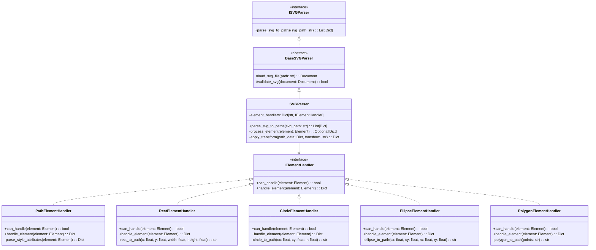

# High-Complexity Functions Refactoring Design

**Date**: 2025-05-20
**Time**: 23:25

## Overview

This document outlines the specific refactoring approach for the 6 high-complexity functions identified in our baseline metrics. Each function will be refactored using SOLID principles, parameter objects, and appropriate design patterns to reduce complexity and improve maintainability.

## 1. `trace_png_to_svg` (Complexity: 29)

### Current Issues
- High cyclomatic complexity (29)
- Multiple responsibilities (image loading, processing, contour detection, SVG generation)
- Difficult to test and maintain

### Refactoring Approach

### Benefits
- **Single Responsibility**: Each class has a single, focused responsibility
- **Open/Closed**: New image tracers or contour detectors can be added without modifying existing code
- **Dependency Inversion**: High-level modules depend on abstractions
- **Reduced Complexity**: Each method has a clear, focused purpose

## 2. `extract_frames` (Complexity: 25)

### Current Issues
- High cyclomatic complexity (25)
- Multiple responsibilities (video loading, frame extraction, image processing, file saving)
- Many optional parameters with complex interactions

### Refactoring Approach

### Benefits
- **Parameter Object**: Complex parameters consolidated into a structured object
- **Strategy Pattern**: Frame processing strategy can be swapped out
- **Single Responsibility**: Each class has a clear, focused purpose
- **Testability**: Each component can be tested in isolation

## 3. `convert_video` (Complexity: 24)

### Current Issues
- High cyclomatic complexity (24)
- Too many parameters (13)
- Multiple responsibilities (input validation, ffmpeg command building, progress tracking)
- Complex conditional logic for different formats and options

### Refactoring Approach

### Benefits
- **Strategy Pattern**: Different format handlers for different output formats
- **Parameter Object**: 13 parameters consolidated into a single object
- **Single Responsibility**: Command building, execution, and progress parsing separated
- **Open/Closed**: New formats can be added by implementing IFormatHandler

## 4. `process_video_task` (Complexity: 21)

### Current Issues
- High cyclomatic complexity (21)
- Multiple responsibilities (task management, video processing, error handling)
- Complex conditional logic for different output formats
- Difficult to test due to many dependencies

### Refactoring Approach

### Benefits
- **Factory Pattern**: Converter factory creates the appropriate converter
- **Template Method**: Base task processor defines the workflow
- **Strategy Pattern**: Different processors for different task types
- **Dependency Injection**: All dependencies are injected and can be mocked for testing

## 5. `convert_video_format_task` (Complexity: 15)

### Current Issues
- High cyclomatic complexity (15)
- Many parameters (13)
- Similar issues to `process_video_task`
- Duplicated code for task management

### Refactoring Approach

### Benefits
- **Inheritance**: Reuses base task processor logic
- **Parameter Object**: Uses VideoConversionParams to simplify parameter handling
- **Single Responsibility**: Focused on video format conversion tasks only
- **DRY Principle**: Eliminates duplication with other task processors

## 6. `parse_svg_to_paths` (Complexity: 11)

### Current Issues
- Moderate cyclomatic complexity (11)
- Multiple responsibilities (file loading, XML parsing, path extraction, transformation)
- Complex handling of different SVG elements

### Refactoring Approach

### Benefits
- **Chain of Responsibility**: Element handlers process different SVG elements
- **Single Responsibility**: Each handler focuses on one element type
- **Open/Closed**: New element types can be supported by adding new handlers
- **Testability**: Each handler can be tested independently

## Implementation Strategy

The implementation of these refactorings will follow a phased approach:

1. **Phase 1**: Create interfaces and base classes
2. **Phase 2**: Implement concrete classes with minimal functionality
3. **Phase 3**: Migrate existing code to use the new architecture
4. **Phase 4**: Add comprehensive tests for each component

Each function will be refactored one at a time, starting with the most complex (`trace_png_to_svg`) and working down to the least complex. This approach allows us to establish patterns and reuse them across multiple functions.

## Expected Outcomes

- **Reduced Complexity**: Each method will have a cyclomatic complexity < 10
- **Improved Readability**: Clear, focused classes with single responsibilities
- **Enhanced Testability**: Components can be tested in isolation
- **Better Maintainability**: Changes to one component won't affect others
- **Code Reduction**: Overall code size will be reduced by eliminating duplication

By applying these refactoring patterns consistently across all high-complexity functions, we'll achieve a more maintainable, extensible, and robust codebase.
