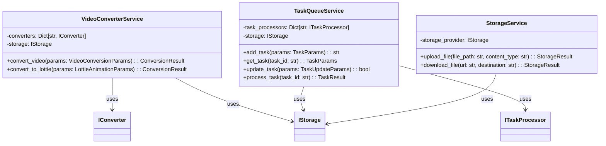

# SOLID Architecture Design for Video Converter

**Date**: 2025-05-20
**Time**: 23:20

## Overview

This document outlines the new architecture for the Video Converter project following SOLID principles. The architecture is designed to improve maintainability, reduce code size, and enhance extensibility while maintaining the core functionality of the system.

## SOLID Principles Implementation

### Single Responsibility Principle (SRP)

Each class will have only one reason to change, focusing on a single responsibility:

- **Converters**: Responsible only for conversion logic
- **Storage**: Responsible only for file storage
- **Task Management**: Responsible only for task queuing and status tracking
- **API Layer**: Responsible only for handling HTTP requests and responses

### Open/Closed Principle (OCP)

The architecture is designed to be open for extension but closed for modification:

- **Strategy Pattern**: For different conversion algorithms
- **Plugin System**: For adding new output formats without changing core code
- **Event System**: For adding new behaviors without modifying existing code

### Liskov Substitution Principle (LSP)

Subtypes must be substitutable for their base types:

- **Converter Interfaces**: All converters implement the same interface
- **Storage Providers**: All storage providers are interchangeable
- **Task Processors**: All task processors follow the same contract

### Interface Segregation Principle (ISP)

Clients should not depend on interfaces they don't use:

- **Specialized Interfaces**: Smaller, focused interfaces instead of large, general ones
- **Role-Based Interfaces**: Interfaces defined by the role they play in the system

### Dependency Inversion Principle (DIP)

High-level modules should not depend on low-level modules; both should depend on abstractions:

- **Dependency Injection**: All dependencies injected through constructors or methods
- **Service Locator**: For resolving dependencies at runtime
- **Abstract Factories**: For creating families of related objects

## Core Architecture Components

### 1. Domain Layer

### 2. Application Layer

### 3. Infrastructure Layer

### 4. API Layer

## Detailed Component Design

### 1. Video Conversion Module

### 2. Lottie Generation Module

### 3. Storage Module

### 4. Task Queue Module

## Dependency Injection Container

## Application Startup Flow

## Task Processing Flow

## Benefits of the New Architecture

1. **Improved Maintainability**:
   - Clear separation of concerns
   - Smaller, focused classes and functions
   - Reduced coupling between components

2. **Enhanced Extensibility**:
   - New formats can be added by implementing interfaces
   - New storage providers can be easily integrated
   - New task processors can be registered without modifying existing code

3. **Better Testability**:
   - Dependencies are injected and can be mocked
   - Interfaces define clear contracts
   - Components can be tested in isolation

4. **Reduced Code Size**:
   - Common functionality extracted to base classes
   - Parameter objects reduce function parameter complexity
   - Shared utilities eliminate duplication

## Implementation Strategy

The implementation of this architecture will follow a phased approach:

1. **Phase 1**: Create interfaces and base classes
2. **Phase 2**: Implement core services with dependency injection
3. **Phase 3**: Refactor existing code to use the new architecture
4. **Phase 4**: Add new features and optimizations

Each phase will be accompanied by comprehensive tests to ensure functionality is maintained throughout the refactoring process.
